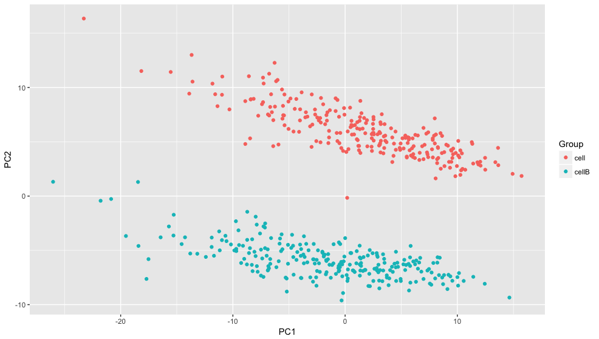

# sinsynthr: Single Cell RNAseq Synthetic Data Simulator

This is an R package for quickly simulating single cell RNAseq read count data. The model is based on data from droplet based methods, for other methods [Splatter](https://github.com/Oshlack/splatter) may be better suited.

## Installation

```R
# install.packages("devtools")
devtools::install_github("daniel-wells/sinsynthr")
```

## Quick Start
```R
library(sinsynthr)

# Use default parameters
new_parameters <- sinsynthr_parameters()

# Simulate counts
dge <- simulateDGE(new_parameters)

# Normalise Counts matrix
normalised_dge <- normaliseDGE(dge)

# Do a PCA to check
dge_pca <- prcomp(normalised_dge)
qplot(dge_pca$x[,1], dge_pca$x[,2], colour=rownames(dge_pca$x)) + labs(colour="Group", y="PC2", x="PC1")
```



For more detailed examples of how to use this package please see the [vignette](vignettes/vignette.md).

## Directory Organisation
The [R/](R/) directory contains source code of the functions to simulate the data.

The [man/](man/) directory contains the manual pages for the functions, compiled by roxygen.

The [vignettes/](vignettes/) directory contains uncompiled Rmarkdown with examples of use.

The [tests/](tests/) directory contains the unit tests which are carried out by the testthat R package.

Contributions of any size or form are welcome!