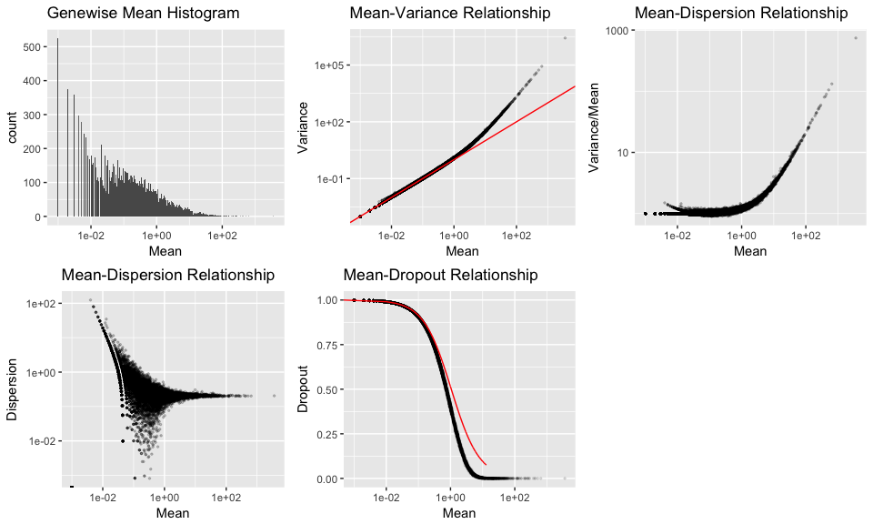
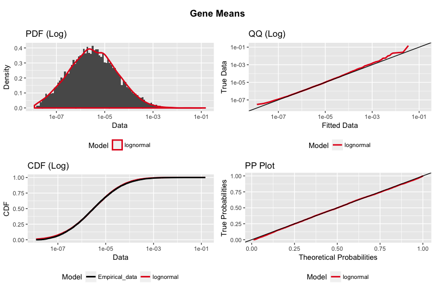

dropsim: Single Cell RNA-seq Simulator
================
Daniel Wells
2018-01-10

Model Description
-----------------

This is a package for simulating single cell RNAseq data. The target is a digital gene expression matrix counts matrix C (N cells by L genes). If cells, genes, and cell types are indexed by n, l, and t respectively then:

$$
C\_{nl} = \\mathit{Poisson}\\big(
          \\frac{e\_{t(n)l}}{\\sum\_{l=1}^{L} e\_{t(n)l}} \\
          s\_n
          \\big)
$$

Where e is the true baseline expression and s is the library size, each of which are drawn from a lognormal distribution. A realistic differential expression profile between cell types can be simulated by multiplying the baseline expression values e by a log-logistic distribution.

Simple Example
--------------

``` r
library(dropsim)
set.seed(42)

new_parameters <- new("dropsim_parameters",
                      n_genes = 15000L,
                      n_cells = 1000L,
                      gene_meanlog = -12,
                      gene_sdlog = 2.5,
                      library_meanlog = 10,
                      library_sdlog = 0.4,
                      groups = data.table::data.table(
                        scale = c(0.06,0.06,0.06,0.04),
                        cells = list(1:200, 201:600, 601:620, sample.int(1000, size=100, replace = TRUE)),
                        names = c("A","B","C","2")
                      )
                      )

# Simulate counts
dge <- simulateDGE(new_parameters, seed = 42)$counts

str(as.matrix(dge))
```

    ##  num [1:15000, 1:1000] 1 0 2 0 0 0 2 0 6 0 ...
    ##  - attr(*, "dimnames")=List of 2
    ##   ..$ gene: chr [1:15000] "1" "2" "3" "4" ...
    ##   ..$ cell: chr [1:1000] "cellA2" "cellA2" "cellA" "cellA2" ...

Summary Plots
-------------

We can then calculate gene-wise summaries and visualise the simulated dataset

``` r
# Summarise Counts matrix
summarised_dge <- summariseDGE(dge, name="Simulation 1")

# Plot summary plots
plot_summaryDGE(summarised_dge)
```



PCA
---

We can also do a PCA analysis to see if the groups separate

``` r
# Normalise Counts matrix
normalised_dge <- normaliseDGE(dge)

# Do a PCA to check
dge_pca <- prcomp(normalised_dge)

# Plot PCA
qplot(dge_pca$x[,1], dge_pca$x[,2], colour=rownames(dge_pca$x)) + labs(colour="Group", y="PC2", x="PC1")
```


Comparisons
-----------

If we have multiple datasets we can do comparisons

``` r
summarised_dge_2 <- summariseDGE(simulateDGE(dropsim_parameters(), seed=42)$counts, name="Simulation 2")
dispersionDGE(rbind(summarised_dge, summarised_dge_2)) + facet_wrap(~Name)
```


Simulate based on dataset
-------------------------

If you have data you want to match the properties of you can create parameters from them

``` r
new_parameters <- fit_parameters(dge)
```



``` r
print(new_parameters)
```

    ## An object of class "dropsim_parameters"
    ## Slot "n_genes":
    ## [1] 15000
    ## 
    ## Slot "n_cells":
    ## [1] 1000
    ## 
    ## Slot "gene_meanlog":
    ##   meanlog 
    ## -12.67007 
    ## 
    ## Slot "gene_sdlog":
    ##    sdlog 
    ## 2.371764 
    ## 
    ## Slot "library_meanlog":
    ##  meanlog 
    ## 10.02094 
    ## 
    ## Slot "library_sdlog":
    ##     sdlog 
    ## 0.4053606 
    ## 
    ## Slot "groups":
    ## Empty data.table (0 rows) of 3 cols: scale,cells,names
